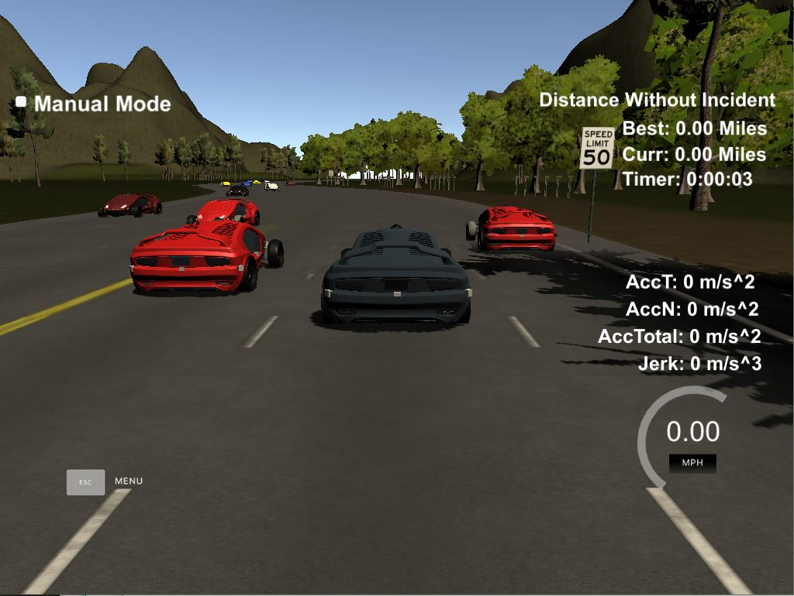

# CarND-Path-Planning-Project
Self-Driving Car Engineer Nanodegree Program

---   
### Simulator Installation
You can download the Term3 Simulator which contains the Path Planning Project from the [Releases tab](https://github.com/udacity/self-driving-car-sim/releases/tag/T3_v1.2).  

To run the simulator on Mac/Linux, first make the binary file executable with the following command:
```shell
sudo chmod u+x {simulator_file_name}
```

---   
### Goals
The purpose of this project is to safely navigate a vehicle around virtual circular highway with other traffic while driving as close to the 50 MPH speed limit as possible. The simulation provides the position and velocity of each vehicle on the road in a global coordinate system and a Frenet coordinate system. The Frenet coordinate system is defined by a sparse set of waypoints around the highway.

The virtual highway has three lanes in each direction. This allows for the possibility of the vehicle to change lanes to overtake other vehicles moving slowly.

The highway is approximately 4.32 miles long. The vehicle is expected to make one complete loop around the highway while avoiding other vehicles, obeying the speed limit, and not violating any acceleration or jerk constraints. In particular, the vehicle speed, acceleration, and jerk must be below 50 MPH, 10 m/s^2, and 10 m/s^3, respectively.

---   

## Contents
* [data/](data/):
  * [highway_map.csv](data/highway_map.csv): CSV file containing map of highway waypoints
* [img/](img/): Images for README
* [src/](src/):
  * [Eigen/](src/Eigen-3.3): Eigen library for linear algebra
  * [helpers.h](src/helpers.h): Helper functions for path planning
  * [json.hpp](src/json.hpp): Helper functions for handling JSON objects, used for communication between highway simulator and path planner
  * [main.cpp](src/main.cpp): Main function which communicates with highway simulator and executes path planning algorithm
  * [spline.h](src/spline.h): Spline interpolation library, taken from [here](http://kluge.in-chemnitz.de/opensource/spline/)
* [CMakeLists.txt](CMakeLists.txt): CMakeLists.txt file used to build the path planner.
* [install-mac.sh](install-mac.sh): Bash script used to install necessary libraries for MacOS
* [install-ubuntu.sh](install-ubuntu.sh): Bash script used to install necessary libraries for Ubuntu

---   
## Dependencies

* cmake >= 3.5
  * All OSes: [click here for installation instructions](https://cmake.org/install/)
* make >= 4.1
  * Linux: make is installed by default on most Linux distros
  * Mac: [install Xcode command line tools to get make](https://developer.apple.com/xcode/features/)
  * Windows: [Click here for installation instructions](http://gnuwin32.sourceforge.net/packages/make.htm)
* gcc/g++ >= 5.4
  * Linux: gcc / g++ is installed by default on most Linux distros
  * Mac: same deal as make - [install Xcode command line tools]((https://developer.apple.com/xcode/features/)
  * Windows: recommend using [MinGW](http://www.mingw.org/)
* [uWebSockets](https://github.com/uWebSockets/uWebSockets)
  * Run either `install-mac.sh` or `install-ubuntu.sh`.
  * If you install from source, checkout to commit `e94b6e1`, i.e.
    ```
    git clone https://github.com/uWebSockets/uWebSockets 
    cd uWebSockets
    git checkout e94b6e1
    ```

---   
## Basic Build Instructions

1. Clone this repo.
2. Make a build directory: `mkdir build && cd build`
3. Compile: `cmake .. && make`
4. Run it: `./path_planning`..

---   
## Simulator Details
Here is the data provided from the Simulator to the C++ Program:

### Main vehicle's localization Data (No Noise)
* "x": The vehicle's x position in map coordinates
* "y": The vehicle's y position in map coordinates
* "s": The vehicle's s position in Frenet coordinates
* "d": The vehicle's d position in Frenet coordinates
* "yaw": The vehicle's yaw angle in the map
* "speed": The vehicle's speed in MPH

### Previous path data given to the Planner
* "previous_path_x": The previous list of x points previously given to the simulator
* "previous_path_y": The previous list of y points previously given to the simulator

### Previous path's end s and d values 
* "end_path_s": The previous list's last point's Frenet s value
* "end_path_d": The previous list's last point's Frenet d value

### Sensor Fusion Data, a list of all other vehicles' attributes on the same side of the road. (No Noise)
* "sensor_fusion": A 2D vector of vehicles and then that vehicle's [vehicle's unique ID, vehicle's x position in map coordinates, vehicle's y position in map coordinates, vehicle's x velocity in m/s, vehicle's y velocity in m/s, vehicle's s position in Frenet coordinates, vehicle's d position in Frenet coordinates. 

### The map of the highway is in [data/highway_map.txt](data/highway_map.txt).
Each waypoint in the list contains [x,y,s,dx,dy] values. x and y are the waypoint's map coordinate position, the s value is the distance along the road to get to that waypoint in meters, the dx and dy values define the unit normal vector pointing outward of the highway loop. x, y, and s are in meters. The highway's waypoints loop around so the Frenet s value, distance along the road, goes from 0 to 6945.554.

### Perfect path-following controller
The simulation uses a perfect controller and will visit every (x,y) point it recieves in the list every .02 seconds. The units for the (x,y) points are in meters and the spacing of the points determines the speed of the vehicle. The vector going from a point to the next point in the list dictates the angle of the vehicle. Acceleration both in the tangential and normal directions is measured along with the jerk, the rate of change of total Acceleration. The (x,y) point paths that the planner recieves should not have a total acceleration that goes over 10 m/s^2, also the jerk should not go over 50 m/s^3. (NOTE: As this is BETA, these requirements might change. Also currently jerk is over a .02 second interval, it would probably be better to average total acceleration over 1 second and measure jerk from that.

### Latency between simulator and path planner
There will be some latency between the simulator running and the path planner returning a path, with optimized code usually its not very long maybe just 1-3 time steps. During this delay the simulator will continue using points that it was last given, because of this its a good idea to store the last points you have used so you can have a smooth transition. previous_path_x, and previous_path_y can be helpful for this transition since they show the last points given to the simulator controller with the processed points already removed. You would either return a path that extends this previous path or make sure to create a new path that has a smooth transition with this last path.

---   

## Path Planning Methodology (Reflection)
The path planner drives the vehicle by generating a trajectory of 50 points in front of the vehicle. The spacing of the points is determined by the reference vehicle velocity (up to 50 MPH) and the time it takes for the vehicle to reach each point (0.02 seconds). During each time step, the vehicle travels past a certain number of points in the path. Then, the path planner extends the planned path to account for the "consumed" points. The path extension is performed by the following steps:

### Path Generation Procedure
1. Select points after the path in front of the vehicle using Frenet coordinates
2. Transform the Frenet points to local coordinate system points with the highway waypoint data and the vehicle's position and yaw
3. Fitting a spline to the points
4. Dividing the spline into segments based on the reference vehicle velocity
5. Transforming the segments back to the global XY coordinate system

By default, the path planner will attempt to keep the vehicle in its current lane while traveling at just below the 50 MPH speed limit. It achieves this by performing the 5 step procedure above, incrementing only the Frenet S coordinate, and keeping the Frenet D coordinate constant, and then transforming the Frenet coordinates to global XY coordinates.

The path planner will deviate from this behavior if and only if distance between the vehicle and the vehicle in front of it is less than some threshold and either the lane to the left or the lane to the right of the controlled vehicle is safe to change into. 

To prepare for a lane change, the path planner determines if there is a vehicle in the lane near the controlled vehicle. If there is no vehicle nearby, then the lane is considered "safe." If the lane is safe, then the path planner chooses to change lanes by incrementing or decrementing the reference Frenet d coordinate by one lane width when generating the path following the 5-step procedure above.

The path planner checks if the left lane is "safe" before checking if the right lane is safe. If the left lane is safe, then the planner controls the vehicle to change to the left lane. If the left lane is not safe, then the planner controls the vehicel to change to the right lane. If neither lane is safe, then the planner commands the vehicle to slow down in the current lane by lowering the reference speed. The reference speed will be increased again (ideally back to just below the speed limit) when the controlled vehicle has sufficient space in front of it.

---

## Results
Using the path planning methodology described above, I was able to navigate the vehicle around the entire highway in roughly 5 minutes without violating any velocity, acceleration, or jerk constraints, and without colliding with any other vehicles.